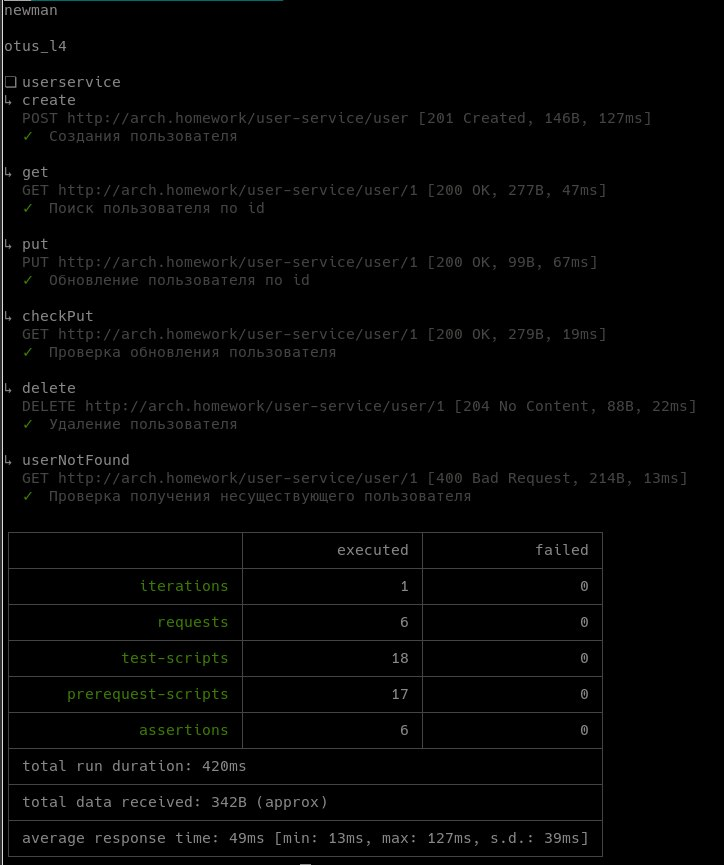
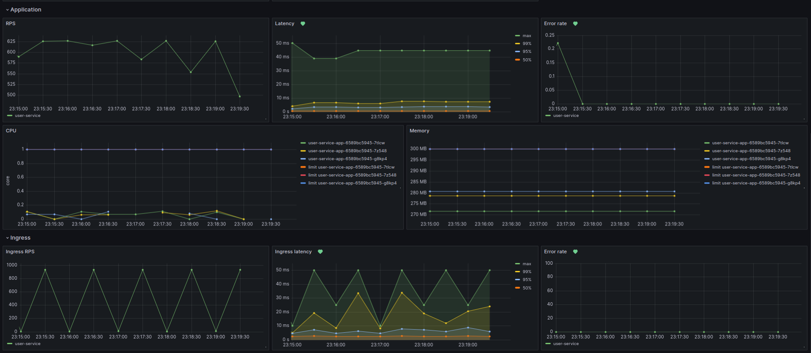
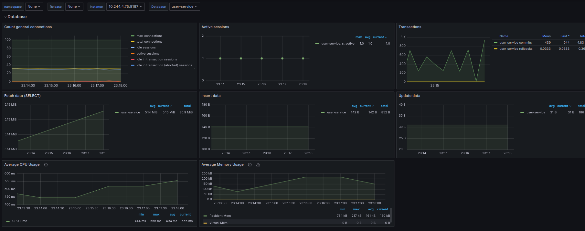
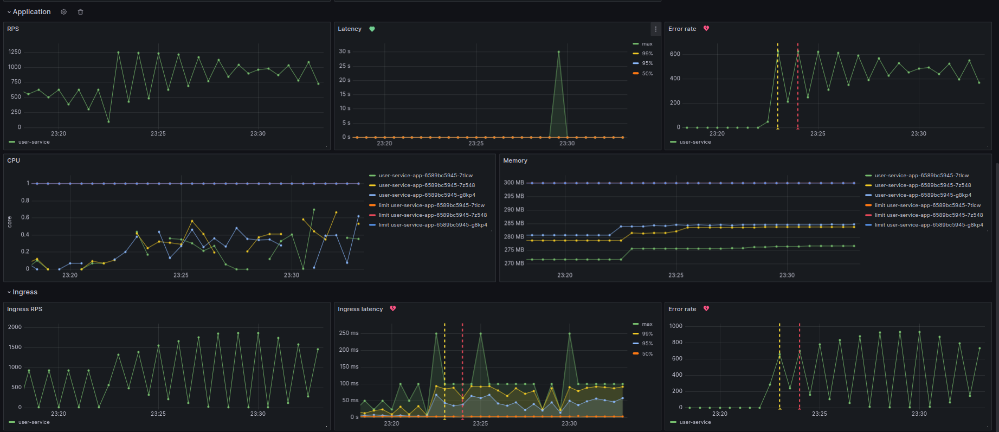
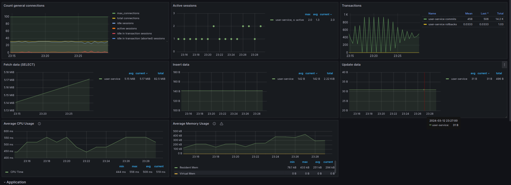

### Запуск приложения

```shell
kubectl create namespace abdalovalex && helm install user-service user-service --namespace abdalovalex
```

1. До установки запускаются следующие ресурсы:
   1. Запуск БД
   2. Установка ConfigMap и Secret
   3. Запуск Job c миграциями. Job ждет запуска БД.
2. Запуск Deployment

Для порядка запуска используются initContainer и helm hook.  
ConfigMap и Secret забирает приложение(инструмент SpringCloudKubernetes), для этого создан ServiceAccount 
с ограниченными ролями для приложения.  
API доступно по адресу: http://arch.homework/user-service/user  

### Запуск тестов
```shell
newman run ./tests/tests.json
```


### Grafana
В папке grafana лежат dashboard и alarm_rules.

### Метрики
#### Нагрузка в 30 одновременных запросов пользователей  
Метрики приложения и ingress

Метрики бд


#### Нагрузка в 60 одновременных запросов пользователей + запросы на апи с 500
Метрики приложения и ingress

Метрики бд


При большей нагрузке по графикам видно, что просел latency, разные персентили увеличились по сравнению с обычной 
нагрузкой в несколько раз.
А так же стало потребляться немного больше памяти приложением. Почти в три раза нагрузился CPU.
По бд, почти что изменений нет, кроме увеличения кол-ва открытых транзакций(SELECT).

Включился алертинг для ErrorRate, как для приложения так и для ingress, а так же алертинг 
для ingress latency(настройка для p95, при превышении порога в 20ms), при этом для приложения
настроен точно такой же порог на p95, но он не был превышен. Отсюда можно cделать вывод, что ingress медленный.

Нагрузочное тестирование проводилось с помощью JMeter.

### Удаление
```shell
helm uninstall user-service -n abdalovalex  
kubectl delete namespace abdalovalex
kubectl delete clusterrolebinding user-service
kubectl delete clusterrole user-service 
```
